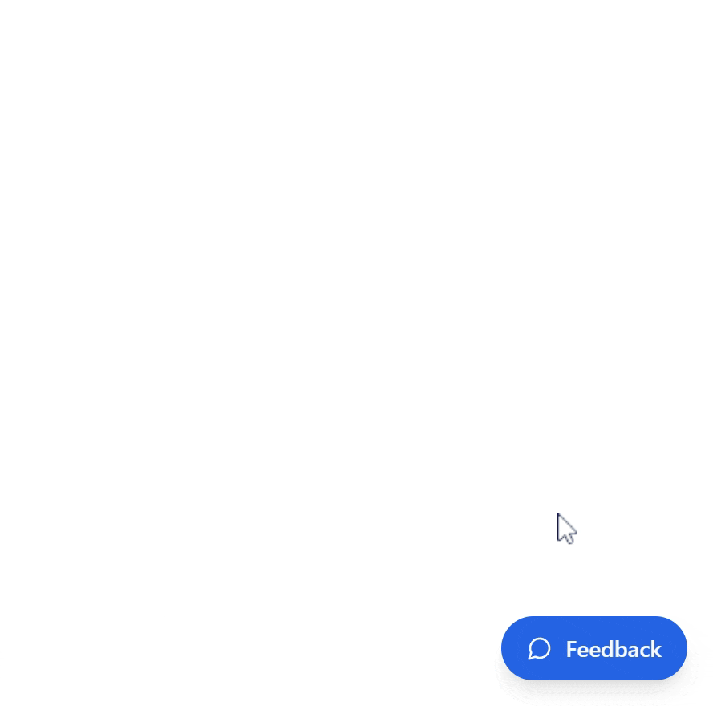

# EngageBox Widget

A lightweight, customizable feedback collection widget that can be easily integrated into any website. Built with Vite and React. Also was built to work with it is [dashboard](https://github.com/MoSaif00/EngageBox-Dashboard.git){:target="\_blank"}



## Prerequisites

Before you begin, ensure you have:

- Node.js (v16 or higher)
- npm or yarn package manager
- A Supabase project set up

## Environment Setup

1. Clone the repository:

```bash
git clone https://github.com/MoSaif00/EngageBox-Widget.git
cd engagebox-widget
```

2. Create a `.env` file in the root directory with the following variables:

```env
VITE_SUPABASE_URL=<Supabase project URL>
VITE_SUPABASE_ANON_KEY=<Supabase anonymous API key>
```

3. Install dependencies:

```bash
npm install
```

4. Start the development server:

```bash
npm run dev
```

## Development

- Built with Vite for optimal development experience
- Uses React for component-based architecture
- Styled with TailwindCSS for utility-first CSS
- Supabase for backend services and real-time data

## Building for Production

```bash
npm run build
```

The built widget will be available in the `dist` directory.
